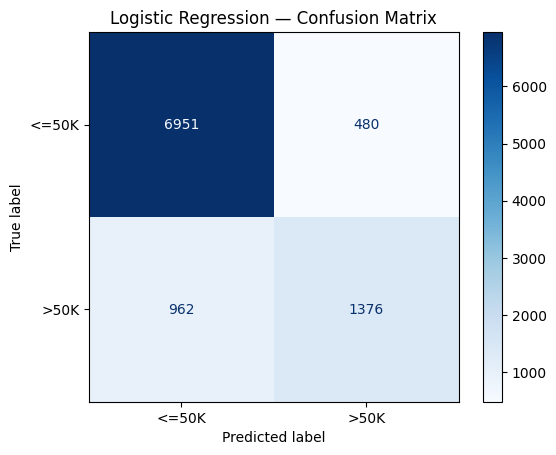

# Does a Neural Network Beat Logistic Regression on Adult Income Data?

This project compares logistic regression with a small neural network for predicting whether a person's annual income exceeds $50,000. It asks whether the network performs better and whether its additional complexity is worthwhile.

## Files

- [Completed notebook](Final_Project_Option2_Tabular_NN_vs_Classical.ipynb): code, outputs, initial prediction, ethics and interpretation.
- `images/`: confusion matrices extracted from the saved outputs.

## Data and prediction task

The Adult Census Income dataset is loaded from OpenML (`adult`, version 2).

- 48,842 rows, each describing one person, and 14 input features.
- Six numerical features, such as age, and eight categorical features, such as occupation.
- Target: `0` for `<=50K` and `1` for `>50K`.
- 11,687 positive examples, approximately 23.9% of the dataset.
- Stratified 80/20 split with `random_state=42`: 39,073 training rows and 9,769 test rows.

Always predicting `<=50K` would achieve approximately 76.1% accuracy while identifying none of the higher-income examples. F1 for the positive class is therefore the main metric; accuracy is supporting information.

## Method

Numerical columns use median imputation and standard scaling. Categorical columns use most-frequent imputation and one-hot encoding, ignoring unknown categories. A `ColumnTransformer` combines them into 105 input features.

**Logistic regression:** preprocessing and `LogisticRegression(max_iter=1000)` form one pipeline. Five-fold stratified cross-validation on the training set fits preprocessing inside each fold. Mean F1 was **0.6576**, with standard deviation **0.0098**. The final pipeline uses the complete training set.

**Neural network:** 105 inputs, Dense(64, ReLU), Dropout(0.3), Dense(32, ReLU), and one sigmoid output: 8,897 trainable parameters. Training uses Adam, binary cross-entropy, 10% validation, batches of 128 and up to 20 epochs. EarlyStopping monitors validation loss with patience 3 and restores the best weights. This run stopped after epoch 5 and restored epoch 2. The prediction threshold is `> 0.5`.

I initially predicted a slightly higher neural-network F1. Both models use the same 9,769 test examples.

## Results from the saved run

| Model | F1 | Accuracy | False negatives | False positives |
|---|---:|---:|---:|---:|
| Logistic Regression | 0.6562 | 0.8524 | 962 | 480 |
| Neural Network | 0.6644 | 0.8558 | 943 | 466 |

F1 improved by approximately 0.0083 and accuracy by 0.34 percentage points, calculated before rounding the displayed scores. The network produced 19 fewer false negatives and 14 fewer false positives: 33 fewer errors overall. Positive-class recall increased from 58.9% to 59.7%, while precision increased from 74.1% to 75.0%.

Matrices use actual classes as rows and predicted classes as columns, ordered `<=50K`, `>50K`.

## Interpretation and ethics

The results support my initial prediction. ReLU layers may help capture nonlinear interactions in this mixed tabular dataset, although the experiment does not establish the cause of improvement.

If predicted higher income were used to deny financial support, false positives could unfairly exclude lower-income people, while false negatives could direct support towards higher-income people. The neural network made fewer errors of both types in this run. I would still retain logistic regression because its simpler interpretation is valuable in this setting and I consider the observed performance difference too small to justify the additional complexity. This is a judgement about that trade-off, not a claim that logistic regression achieved better scores or fewer errors.

Overall metrics do not establish fairness across sex, race or country-of-origin groups. Group representation and error rates need separate examination. Explainability can support transparency but cannot establish fairness by itself.

## Limitations

- Neural-network performance changed on rerunning. No systematic study across fixed seeds or uncertainty estimates was performed. The network seed and exact package versions were not recorded, so further runs may produce different results.
- Following the template, preprocessing uses all outer training rows before Keras creates its validation subset. Validation rows therefore influence preprocessing statistics. A stricter approach would split validation first. The outer test set is excluded from preprocessing fitting.
- The network reserves 10% for validation; logistic regression fits on all training rows.
- Group-level fairness and formal explainability analyses remain future work.

## Reflection and future work

I did not find any particular part especially difficult. The explanatory notebook cells were very helpful. I learned to build and evaluate logistic regression and a neural network, and to choose between them according to the results and the specific use case.

With more time, I would compare performance and error rates across sex, race and nationality groups and add an explainability (XAI) analysis of feature influences, to investigate potential inequalities and improve interpretation.

## Running the notebook

1. Open the notebook in Google Colab, or Jupyter with NumPy, pandas, Matplotlib, scikit-learn and Keras with a supported backend.
2. Connect to the internet for the first data download.
3. Start a fresh runtime and run all cells in order.
4. Save outputs and update results, images and interpretation if a new run changes them.

These results describe the final saved run. Its 14 code cells have consecutive execution counts and no saved errors. The portfolio audit checked those outputs and their consistency with the documentation; it did not independently retrain the models.
